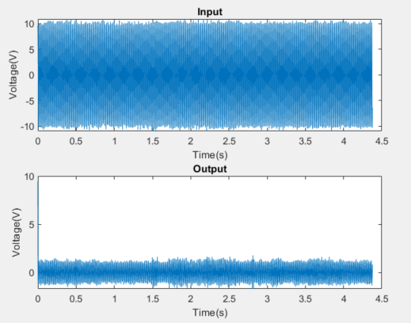
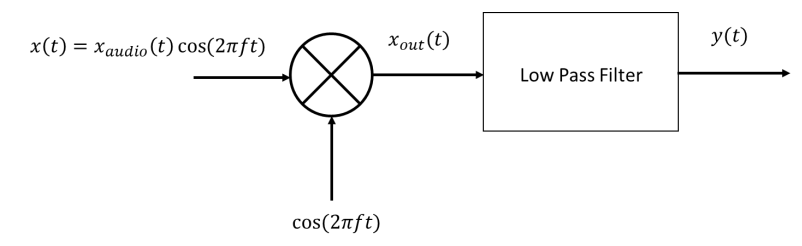
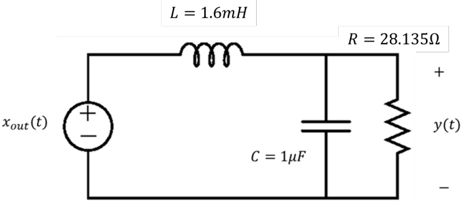
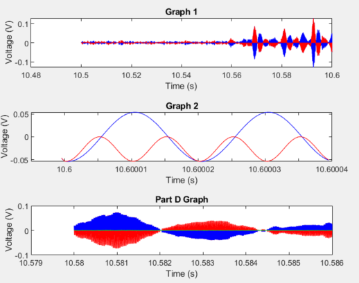

# ECGR-2254
Code from ECGR 2254: Analytical Foundations of ECE

## Project 1:
1. Problem 1 - AC Circuit Simulation

AC Circuit Diagram (Provided in the initial problem):

  

Below is the plot of the inductor current I found after calculating a current phasor equation and discrete time equation for the phasor equation:

  

Below is the plot of the corrected inductor current I found after calculating the proper initial condition for current:

  

2. Problem 2 - Audio Filtering with a High Pass Digital Filter

High Pass Filter Circuit Diagram (Provided in the initial problem):

  

Below is the plot of the input audio file before passing through the high pass filter and the output after passing through the filter:

  

3. Problem 3 - Traditional Communications Using a Demodulator and Low Pass Filter

Demodulator Circuit Diagram (Provided in the initial problem):

  

Low Pass Digital Filter Circuit Diagram (Provided in the initial problem):

  

Below is the plot of the audio file before passing through the demodulator and the output after passing through the filter over 2 different time periods. The last plot shows the input before passing through the low pass filter and the output after passing through:

  

4. Problem 4 - Communications Using Complex Signals
5. Problem 5 - DC Motor Controlling a Robot Arm

*Note: I was unable to upload the .bin files for problems 3 and 4 because they were too large
